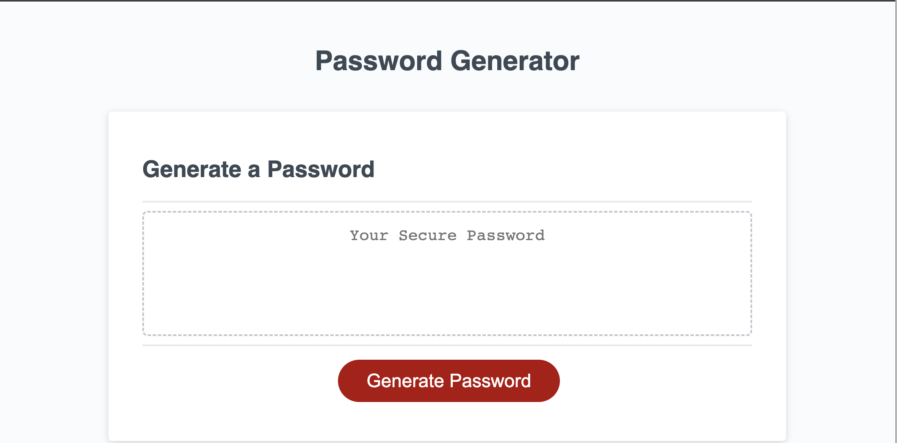
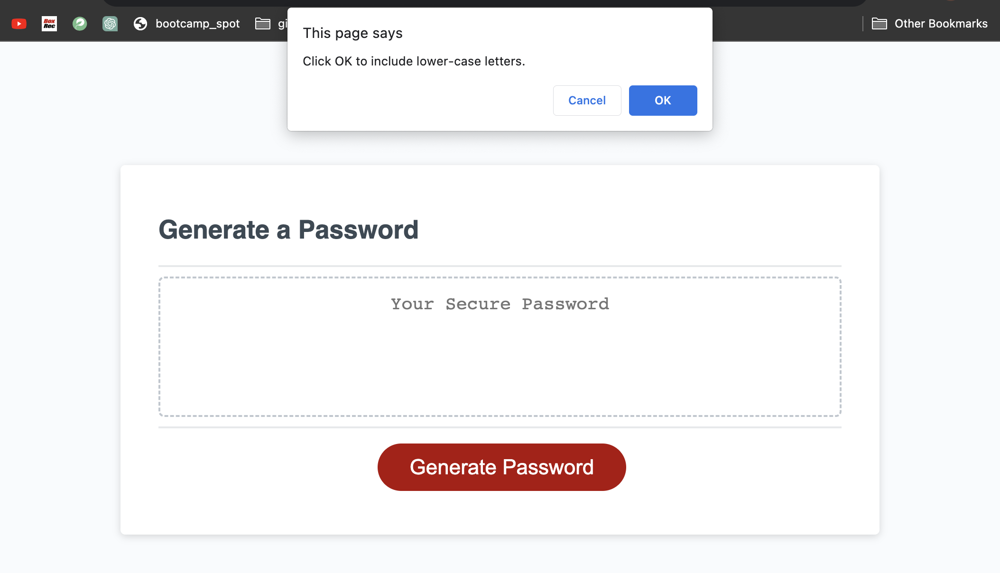
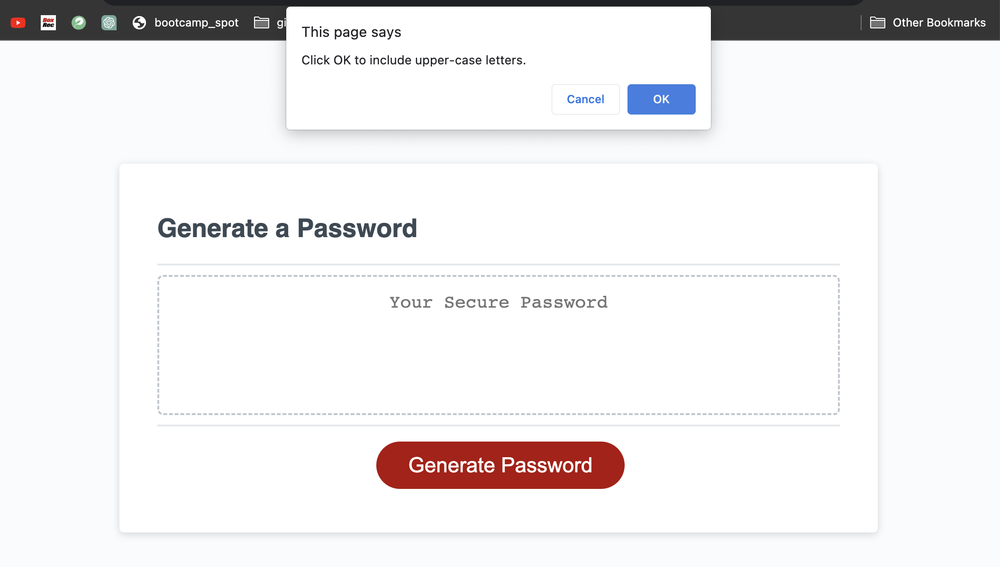
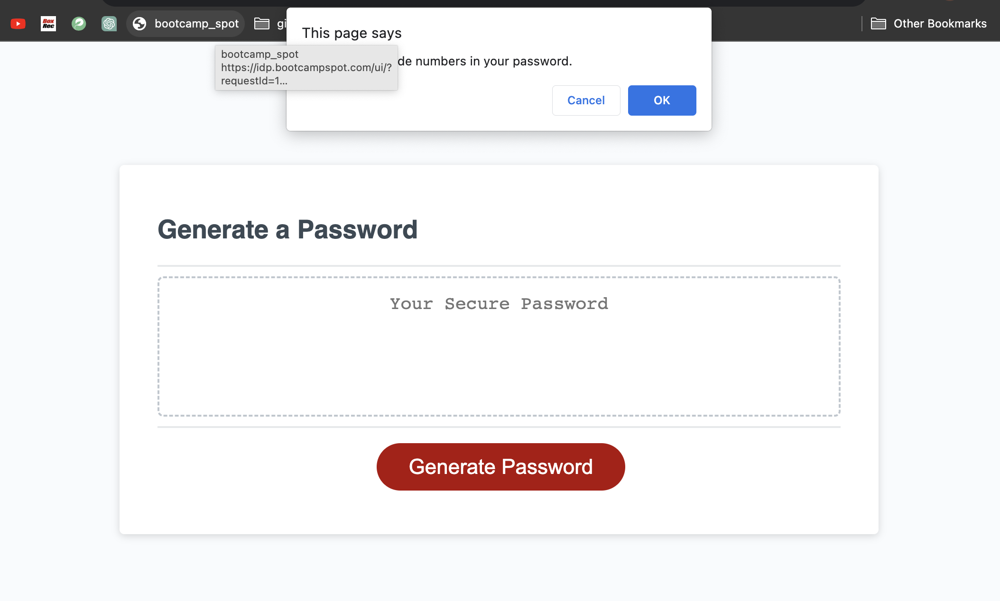
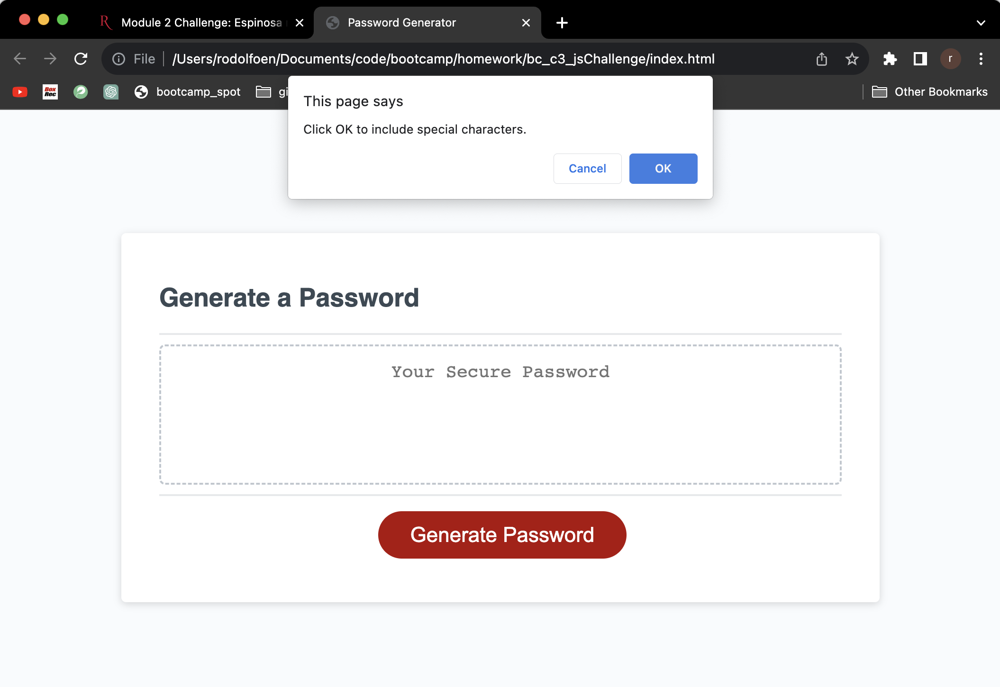
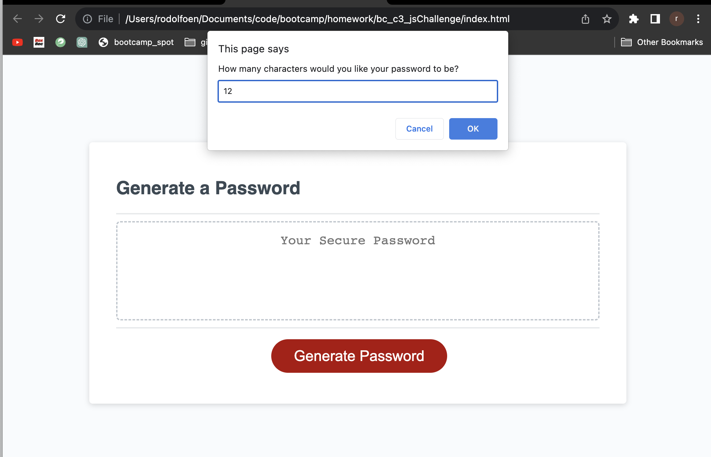
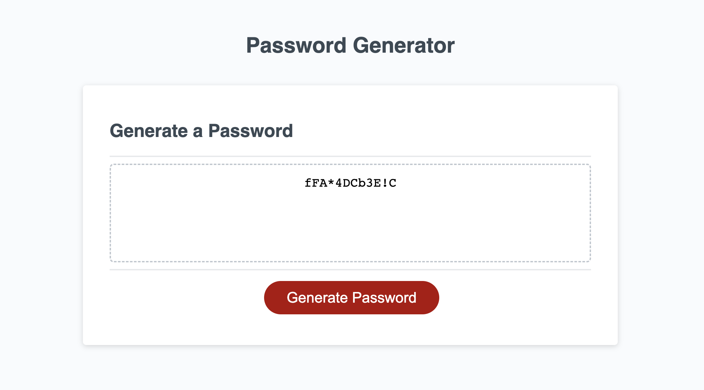

# Project Title
## Generate Password Homework Challenge

## Description
The main focus for this homework assignment was to create a javascript code that will generate a password based on the answered prompts a user enters. The prompts are suppose to come up after the user clicks the "Generate Password" button.

#### DEPLOYED APPLICATION GIT HUB SITE

https://rodolfoespinosa01.github.io/bc_c3_jsChallenge/

#### APPLICATION REPOSITORY LINK

https://github.com/rodolfoespinosa01/bc_c3_jsChallenge

#### SCREENSHOT OF WEBSITE BELOW

      

